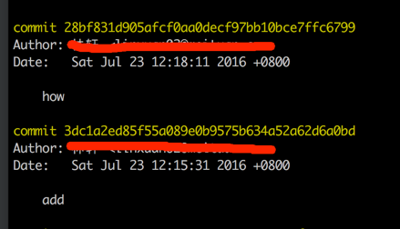

本文总结Git常用的几个技巧

## 技巧1：Git回滚到历史版本   

使用git时偶尔会有回滚到历史版本的需求。用Git怎么操作呢？

    git log
    
可显示历史commit_id、提交人、提交时间和提交时写的备注，如下图：   
  

然后用commit_id回滚，命令如下：

	git reset --hard ${commit_id}   
	
实际操作中，commit_id只需要前6位就可以了，因为前6位足以区分不同的commit。   

## 技巧2：在Git中忽略某些文件    

有时候你不想让编译的文件(比如.pyc)、或者个性化的文件(如果你用IntelliJ IDEA，则.idea下的文件)出现在你的Git仓库中。你可以告诉Git忽略这些文件，方式是建立一个.gitignore文件，写上所有Git应该忽略的文件。比如下面：

	.idea/*
	*.pyc
	logs
	.project
	.classpath
	.settings
	*/target
	*/.settings
	*/.classpath
	*/.project
	*/*.iml

## 技巧3：如何看谁弄乱了我的代码    

当代码出错的时候，人的本性倾向于认为是别人搞错的。那么这个时候如何去找这个人呢？直接用**git blame**就可以。这个命令显示文件中每一行的作者和提交时间。
	
	git blame ${file_name}
	
如图所示：

## 技巧4：创建删除分支   

创建仓库的时候，master是默认分支，为了不污染master分支，开发时需要用各自的分支，建议用开发者的名字命名。创建一个叫做“feature_x”的分支，并切换过去：

	git checkout -b feature_x	
	
切换回主分支：

	git checkout master	
	
再把新建的分支删掉：

	git branch -d feature_x	
	
除非你将分支推送到远端仓库，不然该分支就是 不为他人所见的：

	git push origin <branch>   
			
## 技巧5：更新与合并    

在本地写好代码，准备提交到服务器端。首先commit本地代码，然后将远端的代码pull到本地，如果有conflict则在本地解决完冲突，最后再push到远端。   
更新你的本地仓库到最新改动，执行  

	git pull   
	
git pull其实是执行了*获取（fetch）*并*合并（merge）两个操作。    
要合并其他分支到你的当前分支，执行：    
	
	git merge <branch>   	
	
如果遇到冲突，需要手动解决冲突。改完之后，执行  
	
	git add <filename>   	
	
在合并改动之前，也可以使用如下命令查看：
	
	git diff <source_branch> <target_branch>
	