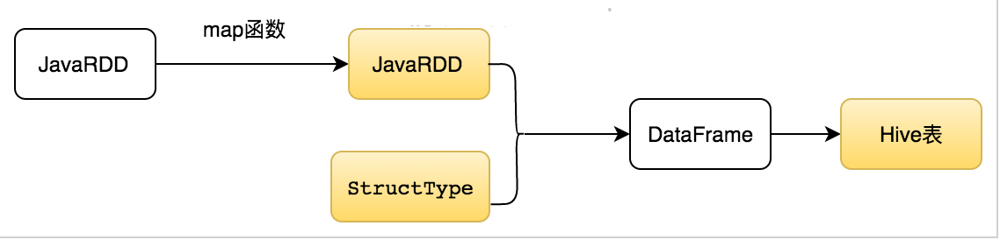

## 主要流程

Spark中将运行结果插入到Hive，有三个实体：JavaRDD、StructType和Hive表，他们之间的关系如下图所示：
   
**JavaRDD**存有Spark的运行结果；   
**StructType**是在Spark中定义的零时表结构；    
**Hive表**需要在hive库中提前创建。

## 主体代码  

以上流程翻译成代码如下：   

	JavaRDD<Row> resultRDD = mapHelper(baseRDD);

    StructType schema = DataTypes.createStructType(getFieldList());

    DataFrame df = hvContext.createDataFrame(resultRDD,schema);
    df.registerTempTable("holiday_model_result");

    String insertSql = insertSql(date);
    hvContext.sql(insertSql);

## 代码详解   

其中`mapHelper`是将原始JavaRDD映射到和临时表相匹配的JavaRDD，代码如下：

	public static JavaRDD<Row> mapHelper(JavaRDD<Row> baseRDD){
	    return baseRDD.map(new Function<Row, Row>() {
	        @Override
	        public Row call(Row row) throws Exception {
	            Long mt_deal_id = row.getLong(0);
	            Long sale_channel = row.getLong(1);
	            Long is_online = row.getLong(2);
	            Double price = row.getDouble(3);
	            Double weekend_coupon_amt = row.getDecimal(4).doubleValue();

	            Row beanRow = RowFactory.create(mt_deal_id, sale_channel, is_online, price, weekend_coupon_amt);
	            return beanRow;
	        }
	    });
	}
	
上面的代码是有问题的，线上运行时遇到上游字段改数据类型问题。比如，mt_deal_id从bigint改成了String，那么row.getLong就会出错。所以比较保险的做法是row.get(0).toString。就是不预先假设数据的类型，而是先取到数据，然后再转换数据类型。	   
	
	
上段代码的功能是类型转换，将Spark结果数据转换成想存的类型。   

`StructType schema = DataTypes.createStructType(getFieldList());` 是要创建临时表结构。其中`getFieldList()`的代码如下：

	public static List<StructField> getFieldList(){
	    return Arrays.asList(
            DataTypes.createStructField("mt_deal_id", DataTypes.LongType, true),
            DataTypes.createStructField("sale_channel", DataTypes.LongType, true),
            DataTypes.createStructField("is_online", DataTypes.LongType, true),
            DataTypes.createStructField("price", DataTypes.DoubleType, true),
            DataTypes.createStructField("weekend_coupon_amt", DataTypes.DoubleType, true),
	    );
	}

`DataFrame df = hvContext.createDataFrame(resultRDD,schema);` 根据RDD和表结构创建DataFrame。   
`df.registerTempTable("holiday_model_result");` 创建临时表。    
`hvContext.sql(insertSql);`执行插入操作。其中插入语句如下：     

	public static String insertSql(String date){
    return  "INSERT INTO mart_catering_test.holiday_model_result PARTITION(partition_date='"+date+"') " +
            "SELECT " +
            "mt_deal_id," +
            "sale_channel," +
            "is_online," +
            "price," +
            "weekday2_trd_amt," +
            "weekend_coupon_amt FROM holiday_model_result";
	}
	
其中`holiday_model_result`是创建的临时表， `mart_catering_test.holiday_model_result`是hive库中建立的表。  
`mart_catering_test.holiday_model_result`在hive中的建表语句为：    
	
	CREATE TABLE IF NOT EXISTS `$target.table`
	(
	  `mt_deal_id ` bigint 
	, `sale_channel` bigint 
	, `is_online` bigint 
	, `price` double 
	, `weekend_coupon_amt` double 
	) COMMENT '节假日模型结果表'
	PARTITIONED BY (
	  partition_date STRING COMMENT "日期分区 yyyy-MM-dd"
	)
	STORED AS ORC;
	
其中`target.table=mart_catering_test.holiday_model_result`。    

（完）