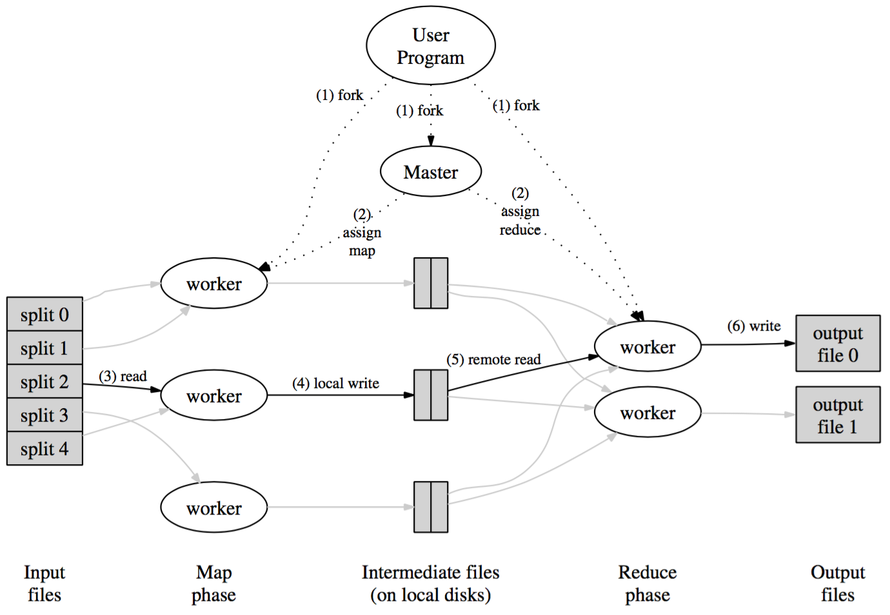

## 摘要    

MapReduce是一种处理大规模数据集的编程模型。MapReduce分为map函数和reduce函数，map函数处理key/value对并产生一堆key/value对，reduce函数合并所有中间key/value对中key相同的对。很多现实世界的任务都可由MapReduce模型表示。    

## 编程模型  

MapReduce模型的输入和输出都是一堆key/value对。MapReduce使用者将只需要实现两个函数： Map和Reduce。 Map函数将一堆key/value对作为输入，并输出一堆中间key/value对。MapReduce将相同key值的key/value对合并后，作为Reduce函数的输入。 Reduce函数，接收的参数形式为1个中间key值和多个value值。Reduce函数合并所有这些value值。一般来说value值会通过迭代的方式提供给Reduce函数，这样也可以处理大到内存装不下value列表。     

以wordcounter的程序为例，要数出一堆文档中每个单词出现的次数。伪代码如下:  

	map(String key, String value): 
		// key: document name
		// value: document contents 
		for each word w in value:
			EmitIntermediate(w, "1");		
	
	reduce(String key, Iterator values): 
		// key: a word
		// values: a list of counts
		int result = 0;
    	for each v in values:
      		result += ParseInt(v);
    	Emit(AsString(result));

map函数产生每个单词和出现次数（为了简单，在本例中为1），reduce函数将一个单词出现的次数加起来。本例完整的程序会附在文后。    

## 执行过程    
多台机器并行调用Map的将输入数据分成M个split，输入的分片可被不同机器并行处理。多台机器调用Reduce将中间key分割成R个分片。R的数量可由用户指定。下图说明了用户调用MapReduce函数时，一系列发生的动作。     
      

1. 用户程序中的MapReduce库将输入数据分成M片大小固定的片（每片大小16~64MB，可以由参数指定），然后将程序拷贝到集群中。
2. 其中一个程序拷贝比较特殊-master。其他都是worker，执行master分配的任务。共有M个map任务和R个reduce任务。master挑选空闲的worker，分给它一个map或reduce任务。
3. 被分配map任务的worker读取对应的输入split。Map从输入数据中解析出key/value对并传给Map函数。Map输出的中间key/value对缓存在内存中。
4. 缓存的key/value对周期性的写到本地磁盘，由partition函数分成R个区域。并将磁盘地址传给master，master负责将磁盘地址发送给reduce worker。
5. Master通知reduce work本地磁盘地址后，reduce work用RPC的方式从本地磁盘的map worker读取缓存数据。当读完所有中间数据后，按中间key排序。
6. reduce worker迭代遍历排序后的中间数据，并将每个key和其对应的value列表传给Reduce函数。Reduce函数的输出会追加写到这个reduce partition的输出文件中。
7. 当所有的map和reduce任务完成后，master唤醒用户程序，结束了用户程序调用MapReduce的一套完整流程。

当所有都完成之后，mapreduce的输出在R个文件中（每个reduce任务一个文件）。通常不用将这R个文件合成1个文件，因为这R个文件可以作为下个MapReduce调用的输入或下个应用的输入。

附wordcount完整程序：     
	
	#include "mapreduce/mapreduce.h"

	// User’s map function
	class WordCounter : public Mapper {
	public:
	    virtual void Map(const MapInput &input) {
	        const string &text = input.value();
	        const int n = text.size();
	        for (int i = 0; i < n;) {
	            // Skip past leading whitespace
	            while ((i < n) && isspace(text[i]))
	                i++;

	            // Find word end
	            int start = i;
	            while ((i < n) && !isspace(text[i]))
	                i++;

	            if (start < i)
	                Emit(text.substr(start, i - start), "1");
	        }
	    }
	};

	REGISTER_MAPPER(WordCounter);

	// User’s reduce function
	class Adder : public Reducer {
	    virtual void Reduce(ReduceInput *input) {
			// Iterate over all entries with the
			// same key and add the values
	        int64 value = 0;
	        while (!input->done()) {
	            value += StringToInt(input->value());
	            input->NextValue();
	        }
	        // Emit sum for input->key()
	        Emit(IntToString(value));
	    }
	};

	REGISTER_REDUCER(Adder);

	int main(int argc, char **argv) {
	    ParseCommandLineFlags(argc, argv);

	    MapReduceSpecification spec;

		// Store list of input files into "spec" 
		for (int i = 1; i < argc; i++) {
		    MapReduceInput *input = spec.add_input();
		    input->set_format("text");
		    input->set_filepattern(argv[i]);
		    input->set_mapper_class("WordCounter");
		}

		// Specify the output files:
		// /gfs/test/freq-00000-of-00100
		// /gfs/test/freq-00001-of-00100
		// ...
		MapReduceOutput *out = spec.output();
		out->set_filebase("/gfs/test/freq");
		out->set_num_tasks(100); 
		out->set_format("text");
		out->set_reducer_class("Adder");

		// Optional: do partial sums within map 
		// tasks to save network bandwidth 
		out->set_combiner_class("Adder");

		// Tuning parameters: use at most 2000
		// machines and 100 MB of memory per task 
		spec.set_machines(2000);
		spec.set_map_megabytes(100);
		spec.set_reduce_megabytes(100);

		// Now run it
		MapReduceResult result;
		if (!MapReduce(spec, &result)) abort();

		// Done: ’result’ structure contains info 
		// about counters, time taken, number of 
		// machines used, etc.

		return 0;
	}

