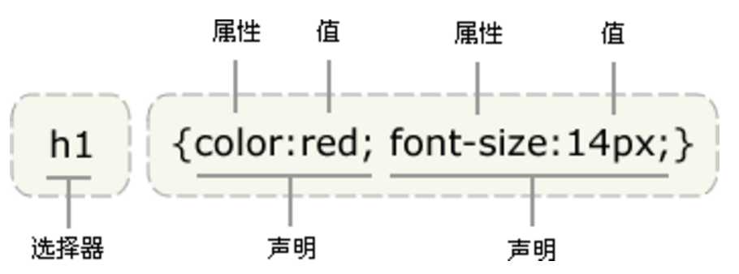

## CSS概述   
- CSS 指层叠样式表 (Cascading Style Sheets)
- 样式定义如何显示 HTML 元素
- 样式通常存储在样式表中
- 外部样式表可以极大提高工作效率，通常存储在 CSS 文件中
- 多个样式定义可层叠为一   

## 层叠次序
当同一个 HTML 元素被不止一个样式定义时，会使用哪个样式呢？    
一般而言，所有的样式会根据下面的规则层叠于一个新的虚拟样式表中，其中数字 4 拥有最高的优先权。    
1. 浏览器缺省设置  
2. 外部样式表  
3. 内部样式表（位于 <head> 标签内部）  
4. 内联样式（在 HTML 元素内部）  

## CSS基础语法    
CSS 规则由两个主要的部分构成：选择器，以及一条或多条声明。    
	
	selector {declaration1; declaration2; ... declarationN }   

选择器通常是您需要改变样式的 HTML 元素。
每条声明由一个属性和一个值组成。如下图所示：
   

**记得写引号**  
如果值为若干单词，则要给值加引号：
	
	p {font-family: "sans serif";}   
	
**多重声明**   
如果要定义不止一个声明，则需要用**分号**将每个声明分开。最后一条规则是不需要加分号的，但最好加上。因为从现有的规则中增减声明时，会尽可能地减少出错的可能性。    

**空格和大小写**  
是否包含空格不会影响 CSS 在浏览器的工作效果，同样，与 XHTML 不同，CSS 对大小写不敏感。   
不过存在一个例外：如果涉及到与 HTML 文档一起工作的话，class 和 id 名称对大小写是敏感的。   

## 选择器的分组    
分组的选择器就可以分享相同的声明    

	h1,h2,h3,h4,h5,h6 {
		color: green;
	}    
	
## 继承    
CSS中，子元素从父元素继承属性   
破除继承：创建一个针对 p 的特殊规则，这样它就会摆脱父元素的规则    

## CSS类选择器   
在 CSS 中，类选择器以一个点号显示：

	.center {text-align: center}   
	
在上面的例子中，所有拥有 center 类的 HTML 元素均为居中。   

**结合元素选择器**  
p.center {text-align: center}     
只有包含center类的元素中的p元素居中。    

**CSS多类选择器**    

	.important {font-weight:bold;}
	.warning {font-style:italic;}
	.important.warning {background:silver;}

